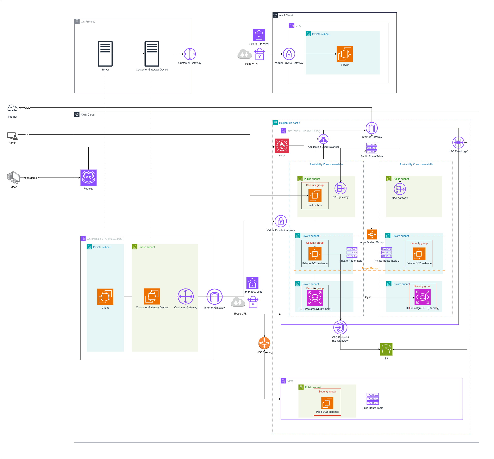

# AWS Hybrid Highly Available Web Architecture



## Overview

This project demonstrates a production-inspired AWS architecture designed with High Availability, Security, Scalability, Hybrid Connectivity, and Cost Optimization principles.

The solution integrates an on-premises environment with AWS through a Site-to-Site VPN connection while providing a highly available web application deployed across multiple Availability Zones.

---

## Architecture Components

### DNS Layer

#### Amazon Route 53

Provides DNS resolution and routes user traffic to the application.

Responsibilities:
- Domain name resolution
- Traffic routing
- High availability DNS service

---

### Security Layer

#### AWS WAF

Protects the application from common web attacks.

Features:
- SQL Injection protection
- Cross-Site Scripting (XSS) protection
- IP filtering
- Rate limiting
- Managed security rules

---

### Load Balancing Layer

#### Application Load Balancer (ALB)

Distributes incoming traffic across application instances running in multiple Availability Zones.

Benefits:
- Layer 7 routing
- High availability
- Health checks
- Target group management

---

### Compute Layer

#### Auto Scaling Group (ASG)

Maintains application availability and automatically adjusts capacity based on demand.

Features:
- Automatic scale-out
- Automatic scale-in
- Self-healing
- Multi-AZ deployment

#### Amazon EC2

Application servers are deployed in private subnets across two Availability Zones.

Benefits:
- Not publicly accessible
- Improved security
- Fault tolerance

---

### Database Layer

#### Amazon RDS PostgreSQL Multi-AZ

Architecture:

```text
Primary Database (AZ-a)
          ↓
Synchronous Replication
          ↓
Standby Database (AZ-b)
```

Benefits:
- Automatic failover
- High availability
- Managed backups
- Managed patching

---

### Storage Layer

#### Amazon S3

Stores application assets, logs, backups, and files.

#### S3 Gateway Endpoint

Provides private access from the VPC to Amazon S3 without traversing the public internet.

Benefits:
- Improved security
- Reduced NAT Gateway costs
- Lower latency

---

### Networking Layer

#### Amazon VPC

Provides network isolation for AWS resources.

#### Public Subnets

Contain:
- Application Load Balancer
- NAT Gateways
- Bastion Host

#### Private Subnets

Contain:
- Application EC2 Instances
- RDS PostgreSQL

#### Internet Gateway

Allows communication between public resources and the internet.

#### NAT Gateway

Deployed in each Availability Zone to provide internet access for resources in private subnets.

Benefits:
- High availability
- No single point of failure

---

### Hybrid Connectivity

#### Site-to-Site VPN

Provides secure communication between on-premises infrastructure and AWS.

Components:
- Customer Gateway (CGW)
- Virtual Private Gateway (VGW)
- IPSec VPN Tunnel

Use Cases:
- Hybrid cloud workloads
- Data synchronization
- Secure internal communication

---

### VPC Peering

Enables private communication between VPCs using AWS backbone networking.

Benefits:
- Private routing
- Low latency
- No internet traversal

---

### Monitoring

#### VPC Flow Logs

Capture network traffic information for troubleshooting and security analysis.

Use Cases:
- Network monitoring
- Security auditing
- Traffic analysis

---

## Traffic Flow

### User Request Flow

```text
User
 ↓
Route 53
 ↓
AWS WAF
 ↓
Application Load Balancer
 ↓
Target Group
 ↓
Auto Scaling Group
 ↓
EC2 Application Servers
 ↓
RDS PostgreSQL
```

### S3 Access Flow

```text
EC2
 ↓
S3 Gateway Endpoint
 ↓
Amazon S3
```

Traffic never traverses:
- Internet Gateway
- NAT Gateway
- Public Internet

### Hybrid Connectivity Flow

```text
On-Premises Server
 ↓
Customer Gateway Device
 ↓
Customer Gateway
 ↓
IPSec VPN
 ↓
Virtual Private Gateway
 ↓
AWS Resources
```

---

## High Availability Design

### Availability Zone Failure

If AZ-a becomes unavailable:

```text
ALB
 ↓
Routes traffic only to AZ-b

ASG
 ↓
Launches replacement instances

RDS
 ↓
Fails over to standby database
```

Application remains available.

### EC2 Failure

If an EC2 instance becomes unhealthy:

```text
ALB Health Check
 ↓
Instance marked unhealthy

ASG
 ↓
Terminates instance

ASG
 ↓
Launches replacement instance
```

### Database Failure

If the primary database fails:

```text
Primary Database Failure
 ↓
Automatic Failover
 ↓
Standby Becomes Primary
```

Minimal downtime.

---

## Security Design

### Defense in Depth

#### Layer 1 – AWS WAF

Protects against:
- SQL Injection
- XSS
- Bots
- Malicious traffic

#### Layer 2 – Security Groups

Restrict traffic between:
- ALB and EC2
- EC2 and RDS

#### Layer 3 – Private Subnets

Application and database tiers are not exposed to the internet.

#### Layer 4 – Site-to-Site VPN

Encrypted communication between on-premises and AWS.

---

## Cost Optimization

### S3 Gateway Endpoint

Avoids NAT Gateway processing charges for S3 traffic.

### Auto Scaling

Only provisions resources when required.

### Private Subnets

Reduce attack surface and improve operational efficiency.

### Multi-AZ NAT Design

Provides high availability while maintaining network resiliency.

---

## AWS Services Used

| Category | Services |
|-----------|-----------|
| DNS | Route 53 |
| Security | WAF, Security Groups |
| Networking | VPC, IGW, NAT Gateway, VPN, VPC Peering |
| Compute | EC2, Auto Scaling Group |
| Load Balancing | Application Load Balancer |
| Database | RDS PostgreSQL Multi-AZ |
| Storage | Amazon S3 |
| Endpoint | S3 Gateway Endpoint |
| Monitoring | VPC Flow Logs |

---

## Key AWS Concepts Demonstrated

- VPC Design
- Public and Private Subnets
- Route Tables
- Internet Gateway
- NAT Gateway
- Security Groups
- Site-to-Site VPN
- Customer Gateway
- Virtual Private Gateway
- VPC Peering
- Route 53
- AWS WAF
- Application Load Balancer
- Auto Scaling Group
- Multi-AZ Architecture
- Amazon RDS Multi-AZ
- Amazon S3
- S3 Gateway Endpoint
- VPC Flow Logs
- High Availability
- Hybrid Cloud Architecture
- Cost Optimization

---

## Future Enhancements

- AWS Systems Manager Session Manager
- Amazon CloudWatch Metrics and Alarms
- AWS CloudTrail
- AWS Secrets Manager
- Amazon ElastiCache (Redis)
- AWS Backup
- Multi-Region Disaster Recovery
- AWS Global Accelerator

---

## Conclusion

This project demonstrates a secure, highly available, and scalable AWS hybrid cloud architecture following AWS Well-Architected principles. It combines networking, security, compute, storage, database, and hybrid connectivity services into a realistic production-style deployment suitable for learning, portfolio presentation, AWS certification preparation, and technical interviews.
