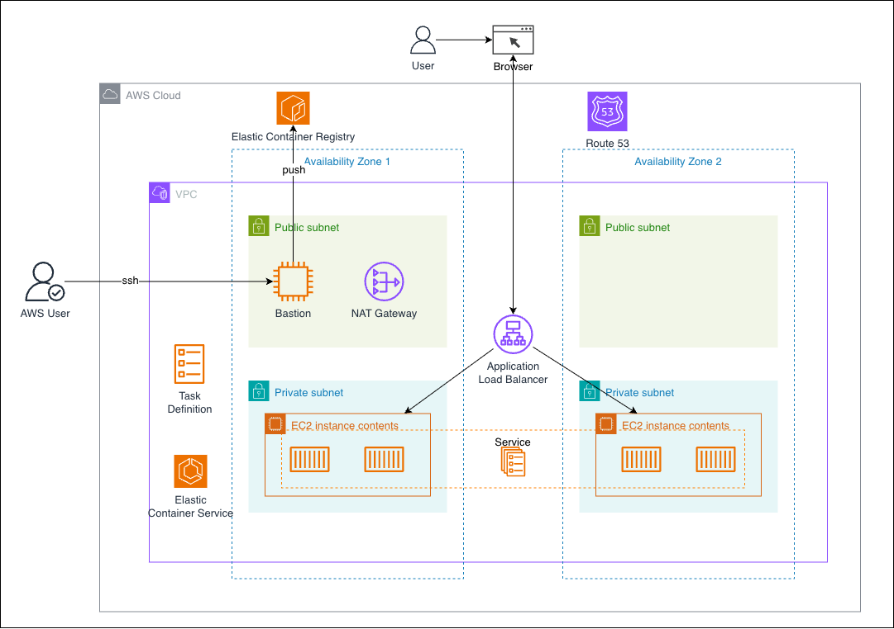

# AWS ECS Highly Available Containerized Application

## Overview

This project demonstrates a highly available containerized web application running on Amazon ECS using the EC2 launch type. The architecture follows AWS best practices for scalability, fault tolerance, security, and container orchestration.

The solution distributes workloads across multiple Availability Zones while using Amazon ECR for container image storage and Application Load Balancer (ALB) for traffic distribution.

---

## Architecture Diagram



---

## Architecture Components

### Amazon Route 53

Provides DNS resolution and routes users to the application.

Responsibilities:
- Domain name resolution
- Traffic routing
- High availability DNS

---

### Application Load Balancer (ALB)

Distributes incoming traffic across ECS tasks running in multiple Availability Zones.

Benefits:
- High availability
- Health checks
- Layer 7 routing
- Traffic distribution

---

### Amazon Elastic Container Registry (ECR)

Stores Docker container images used by ECS tasks.

Benefits:
- Secure container registry
- Version control for images
- Integration with ECS
- Private image storage

---

### Amazon Elastic Container Service (ECS)

Amazon ECS orchestrates container deployment and management.

Responsibilities:
- Container scheduling
- Service management
- Task monitoring
- High availability

---

### ECS Service

Maintains the desired number of running tasks.

Features:
- Self-healing
- Automatic task replacement
- Load balancer integration
- Multi-AZ deployment

---

### ECS Task Definition

Defines container configuration including:

- Docker image
- CPU allocation
- Memory allocation
- Environment variables
- Networking settings
- Port mappings

---

### Amazon EC2 Container Instances

Host ECS tasks using the ECS EC2 launch type.

Benefits:
- Full infrastructure control
- Custom AMIs
- Cost optimization
- Flexible resource allocation

---

### Bastion Host

Provides secure administrative access to private resources.

Responsibilities:
- Secure SSH entry point
- Administrative access
- Infrastructure troubleshooting

---

### NAT Gateway

Provides outbound internet access for resources in private subnets.

Use Cases:
- Pull container images from ECR
- Download software updates
- Access AWS services

---

## Network Design

### VPC

Provides network isolation for all AWS resources.

### Public Subnets

Contain:
- Application Load Balancer
- Bastion Host
- NAT Gateway

### Private Subnets

Contain:
- ECS Container Instances
- ECS Tasks

Application workloads remain inaccessible directly from the internet.

---

## Traffic Flow

### User Request Flow

```text
User
 ↓
Browser
 ↓
Route 53
 ↓
Application Load Balancer
 ↓
ECS Service
 ↓
ECS Tasks
```

### Container Deployment Flow

```text
Developer
 ↓
Docker Build
 ↓
Amazon ECR
 ↓
ECS Service
 ↓
ECS Tasks
```

### Administrative Access Flow

```text
AWS User
 ↓
SSH
 ↓
Bastion Host
 ↓
Private ECS EC2 Instances
```

---

## High Availability Design

### Multi-AZ Deployment

```text
Availability Zone 1
 ├── Public Subnet
 │   ├── NAT Gateway
 │   └── Bastion Host
 └── Private Subnet
     └── ECS Tasks

Availability Zone 2
 ├── Public Subnet
 │   └── NAT Gateway
 └── Private Subnet
     └── ECS Tasks
```

Benefits:
- Fault tolerance
- Improved availability
- Reduced downtime

### ECS Service Recovery

```text
Task Failure
 ↓
Health Check Failure
 ↓
ECS Service Detects Failure
 ↓
Launch Replacement Task
```

### Availability Zone Failure

```text
AZ Failure
 ↓
ALB Routes Traffic
 ↓
Healthy ECS Tasks In Remaining AZ
```

Application remains available.

---

## Security Design

### Layer 1 – Network Isolation

- ECS tasks run in private subnets
- No direct public access

### Layer 2 – Security Groups

Restrict traffic between:
- ALB and ECS Tasks
- Bastion Host and EC2 Instances

### Layer 3 – Bastion Access

```text
Admin
 ↓
SSH
 ↓
Bastion Host
 ↓
Private Resources
```

### Layer 4 – Private Container Workloads

Application containers are not exposed directly to the internet.

Only the ALB receives public traffic.

---

## Scalability Design

### Horizontal Scaling

```text
High Traffic
 ↓
Scale Out
 ↓
More ECS Tasks
```

### Load Balancing

Application Load Balancer distributes requests across all healthy tasks.

Benefits:
- Improved performance
- Increased availability
- Better user experience

---

## AWS Services Used

| Category | Services |
|-----------|-----------|
| DNS | Route 53 |
| Compute | Amazon EC2 |
| Containers | Amazon ECS |
| Container Registry | Amazon ECR |
| Load Balancing | Application Load Balancer |
| Networking | VPC, NAT Gateway |
| Security | Security Groups |
| Administration | Bastion Host |

---

## Skills Demonstrated

- Amazon ECS
- Amazon ECR
- Docker Containers
- Container Orchestration
- Application Load Balancer
- Multi-AZ Architecture
- VPC Design
- Public and Private Subnets
- NAT Gateway
- Route 53
- High Availability
- Scalability
- Cloud Networking
- Infrastructure Design

---

## Future Enhancements

- AWS Fargate
- AWS WAF
- AWS CloudWatch
- ECS Service Auto Scaling
- AWS Secrets Manager
- AWS Systems Manager Session Manager
- Amazon RDS PostgreSQL
- Amazon ElastiCache Redis
- CI/CD with GitHub Actions
- Blue/Green Deployment with AWS CodeDeploy

---

## Conclusion

This project demonstrates a production-ready containerized application architecture using Amazon ECS, Amazon ECR, and Application Load Balancer. The solution provides high availability, scalability, security, and efficient container orchestration while following AWS Well-Architected Framework principles.
