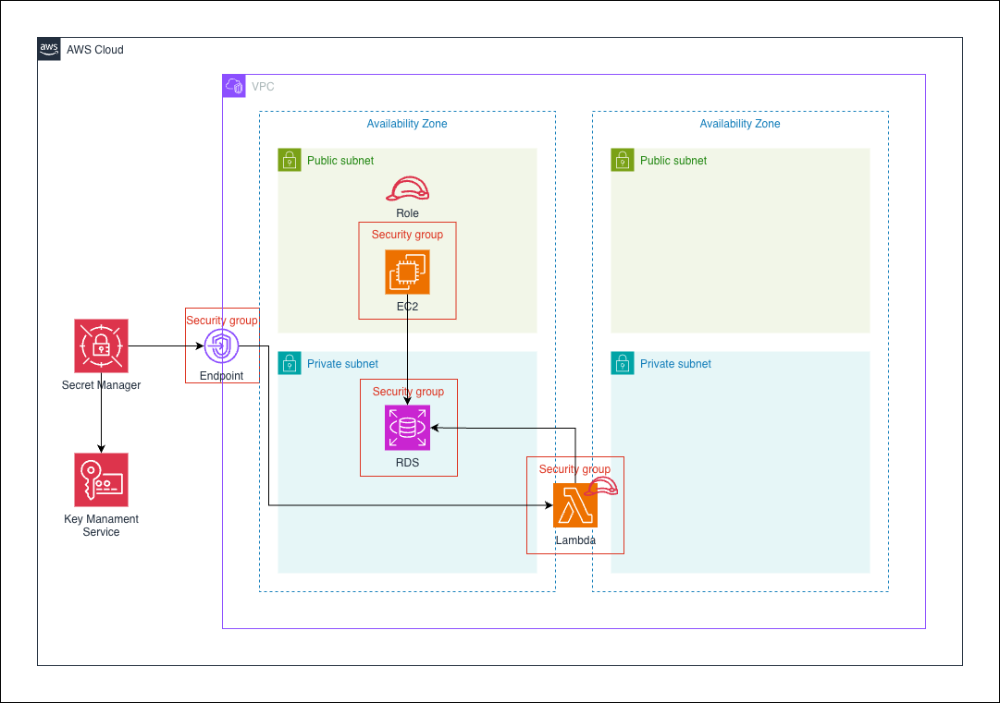

# AWS Serverless Secret Management Architecture

## Overview

This project demonstrates a secure and serverless architecture for managing database credentials using AWS Secrets Manager, AWS KMS, AWS Lambda, and Amazon RDS.

The solution eliminates hardcoded credentials by securely storing secrets in AWS Secrets Manager, encrypting them with AWS Key Management Service (KMS), and retrieving them dynamically through AWS Lambda.

This architecture follows AWS security best practices by implementing least-privilege access, secret encryption, and private connectivity through VPC Endpoints.

---

## Architecture Diagram



---

## Architecture Highlights

- AWS Lambda
- Amazon RDS
- AWS Secrets Manager
- AWS KMS
- IAM Roles
- VPC Endpoint
- Security Groups
- Private Database Access
- Secret Encryption
- Serverless Architecture

---

## Architecture Components

### Amazon RDS

Provides managed relational database services.

Responsibilities:

- Store application data
- Support transactional workloads
- Secure database access

The database is deployed in a private subnet and is not directly accessible from the internet.

---

### AWS Lambda

Executes application logic without managing servers.

Responsibilities:

- Retrieve database credentials
- Connect to Amazon RDS
- Perform database operations
- Process application requests

Benefits:

- Serverless execution
- Automatic scaling
- Reduced operational overhead

---

### AWS Secrets Manager

Stores sensitive information securely.

Responsibilities:

- Store database credentials
- Manage secret rotation
- Control secret access
- Integrate with AWS services

Benefits:

- No hardcoded credentials
- Centralized secret management
- Automatic rotation support

---

### AWS Key Management Service (KMS)

Encrypts secrets stored in AWS Secrets Manager.

Responsibilities:

- Encryption key management
- Secret encryption
- Access control
- Audit integration

Benefits:

- Secure encryption
- Fine-grained access control
- Compliance support

---

### IAM Roles

Provide secure access between AWS services.

Responsibilities:

- Grant Lambda permission to read secrets
- Restrict access using least privilege
- Eliminate credential sharing

Example Permissions:

- secretsmanager:GetSecretValue
- kms:Decrypt
- rds-db:connect

---

### VPC Endpoint

Provides private access to AWS Secrets Manager from within the VPC.

Benefits:

- Traffic remains on AWS network
- No Internet Gateway required
- Improved security
- Reduced exposure

---

### Security Groups

Control network communication between resources.

Configured Rules:

#### Lambda Security Group

Outbound:

- Allow database connections to RDS

#### RDS Security Group

Inbound:

- Allow database traffic from Lambda Security Group

Benefits:

- Network isolation
- Least-privilege connectivity
- Controlled access paths

---

## Network Design

### Public Subnet

Contains:

- EC2 Instance
- IAM Role Attachment

The EC2 instance may act as an application server or administrative host.

### Private Subnet

Contains:

- Amazon RDS
- AWS Lambda

Sensitive resources remain isolated from direct internet access.

---

## Secret Retrieval Flow

```text
Lambda Function
        ↓
Secrets Manager
        ↓
KMS Decrypt
        ↓
Return Credentials
        ↓
Connect to RDS
```

---

## Database Access Flow

```text
Application
      ↓
Lambda Function
      ↓
Secrets Manager
      ↓
KMS
      ↓
Amazon RDS
```

---

## Security Design

### No Hardcoded Credentials

Instead of storing database credentials in:

- Source code
- Configuration files
- Environment variables

Credentials are retrieved dynamically from Secrets Manager.

---

### Encryption at Rest

```text
Secret
 ↓
KMS Encryption
 ↓
Secrets Manager
```

All secrets remain encrypted while stored.

---

### Private Connectivity

```text
Lambda
 ↓
VPC Endpoint
 ↓
Secrets Manager
```

Traffic never traverses the public internet.

---

### Least Privilege Access

IAM roles restrict access to:

- Specific secrets
- Specific KMS keys
- Required database actions

---

## High Availability Considerations

### Lambda

- Automatically scales
- Multi-AZ managed service
- No infrastructure management required

### Secrets Manager

- Managed and highly available
- Replicated within AWS infrastructure

### KMS

- Managed service
- Highly durable key storage

### Amazon RDS

Can be extended to:

- Multi-AZ deployment
- Read replicas
- Automated backups

---

## AWS Services Used

| Category | Services |
|-----------|-----------|
| Compute | AWS Lambda, Amazon EC2 |
| Database | Amazon RDS |
| Security | AWS Secrets Manager, AWS KMS, IAM |
| Networking | Amazon VPC, VPC Endpoint |
| Access Control | Security Groups |

---

## Skills Demonstrated

- AWS Lambda
- Amazon RDS
- AWS Secrets Manager
- AWS KMS
- IAM Roles
- VPC Endpoint
- Security Groups
- Secret Management
- Serverless Architecture
- Secure Credential Handling
- Cloud Security Best Practices
- Infrastructure Design

---

## Challenges & Design Decisions

### Why Secrets Manager Instead of Hardcoded Credentials?

- Improved security
- Centralized secret management
- Supports automatic rotation

### Why KMS?

- Encrypt sensitive information
- Fine-grained key permissions
- Compliance requirements

### Why Lambda?

- Serverless execution
- Automatic scaling
- Reduced infrastructure management

### Why VPC Endpoint?

- Private communication
- No internet dependency
- Reduced security exposure

### Why RDS in Private Subnet?

- Prevent direct public access
- Protect sensitive data
- Follow AWS security best practices

---

## Future Improvements

- RDS Multi-AZ Deployment
- Automatic Secret Rotation
- CloudWatch Monitoring
- CloudTrail Auditing
- AWS WAF Integration
- Aurora PostgreSQL
- Event-Driven Processing
- Infrastructure as Code using Terraform

---

## Key Learning Outcomes

This project helped strengthen practical knowledge in:

- Serverless Computing
- Secret Management
- IAM and Access Control
- Database Security
- Network Isolation
- AWS Security Best Practices
- Secure Application Architecture

---

## Reference
- [AWS Secrets Manager Integration with Amazon RDS](https://blog.cloudmentor.pro/posts/aws-secrets-manager-integration-with-amazon-rds)

---

## Conclusion

This project demonstrates a secure and scalable serverless architecture for managing database credentials on AWS. By combining AWS Lambda, Secrets Manager, KMS, VPC Endpoints, and Amazon RDS, the solution eliminates hardcoded credentials while providing secure, encrypted, and private access to sensitive resources.
